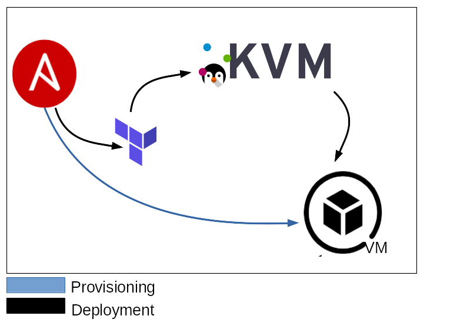
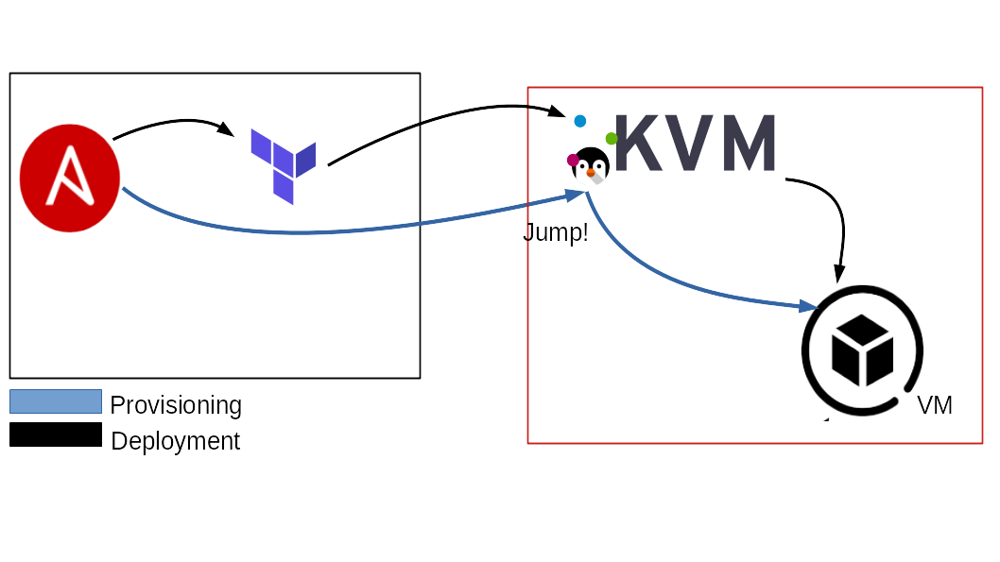
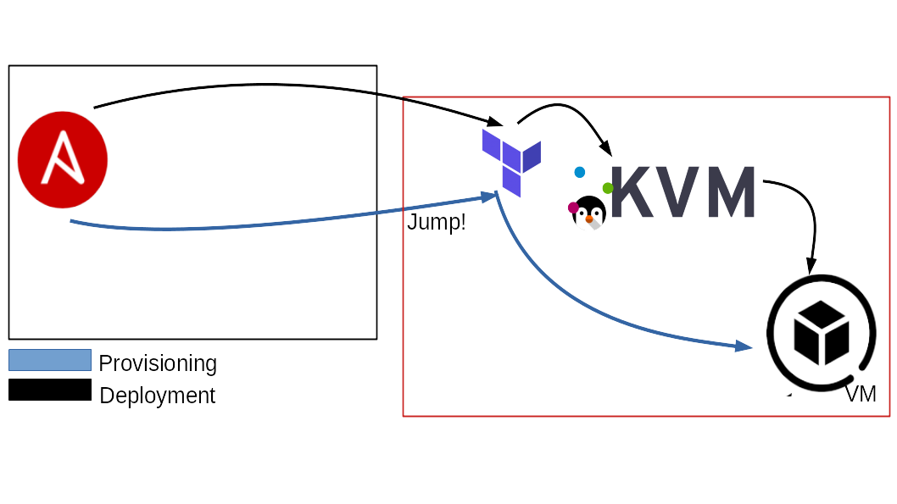
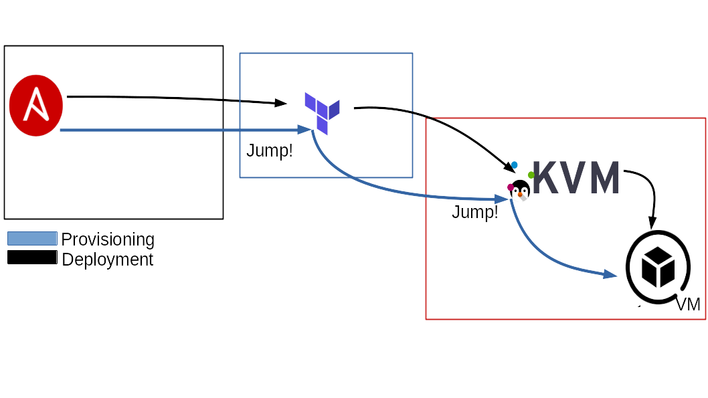

# Terrible: IaC for QEMU/KVM

[](https://www.gnu.org/licenses/gpl-3.0)    


### Workflows Status

[](https://github.com/89luca89/terrible/actions?query=workflow%3A%22Ansible+Lint%22)
[](https://github.com/89luca89/terrible/actions?query=workflow%3A%22Ansible+Validate%22)


This **Ansible** playbook allows you to initialize and then deploy an entire infrastructure through the aid of **Terraform**, on a **QEMU/KVM** environment.

**Terr**aform + Ans**ible**

## Table of Contents

1. [Abstract](#abstract)
   - [Why not just use a single tool?](#why-not-just-use-a-single-tool)
   - [How it works](#how-it-works)
2. [Requirements](#requirements)
3. [Configuration](#configuration)
   - [Variables](#variables)
   - [Terraform node, Bastions & Jumphosts](#terraform-node-bastions--jumphosts)
   - [Network](#network)
   - [Storage](#storage)
4. [Compatibility](#compatibility)
5. [Installation](#installation)
6. [Usage](#usage)
   - [Outputs](#outputs)
7. [Authors](#authors)
8. [License](#license)

## Abstract

The Infrastructure as Code had considerable growth in the cloud in the last years. 
However, a separate discussion has to be done regarding the private cloud. 
For various reasons, companies may need to use an internal infrastructure instead of the cloud. 
Unfortunately, there aren't as many solutions for the private cloud as for the cloud. 
Our idea has been to implement a flexible and powerful solution to easily build an infrastructure from scratch. 
It uses the flexibility of Ansible and the power of Terraform allowing you to abstract both the creation and the provisioning of the infrastructure, 
describing the whole process in a single file. 

### Why not just use a single tool?

On our side, the decision has been driven by the need to create a single 
source of truth for both the creation and provisioning of the infrastructure. 
It has been possible by leveraging Ansible and Jinja2 flexibility to easily generate highly 
dynamical HCL files for Terraform and leverage its power and compatibility to build the infrastructure.

### How It Works

The idea comes from the difficulty to automate the deployment of the VMs on a QEMU/KVM environment.

For this reason we decided to automate as much as possible the process of the deployment, using **Ansible** and **Jinja2**.

First of all we provided a basic **HCL** file (templated with **Jinja2**) to describe a basic VM implementation. This is what is usually called IaC.

Then using Terraform and its amazing provider for libvirt (https://github.com/dmacvicar/terraform-provider-libvirt), we deploy the resultants HCL files generated by Ansible.

The figure below describe the process in an easy way.

](./pics/kvm-deployment.jpg)

As you can see, we start having the templated file (`terraform-vm.tf.j2`). 

When Ansible run, it generates *n* `.tf` files, depending on the VM specified into the inventory. This is the result of the initialization phase. 
Once finished this task, the files are completed and ready to be used by Terraform.

At this time, Ansible takes these files and use Terraform for each instance of them. 
Once finished this task, the VMs, previously described into the inventory, are correctly deployed into the QEMU/KVM server(s).

## Requirements

| Dependency   |      Minimum Version      | Reference |
|----------|:-------------:|-------------|
| Ansible |  2.9+ | https://docs.ansible.com/ |
| Terraform |    0.12+   | https://www.terraform.io/docs/index.html |
| Terraform Provider Libvirt | 0.6+ | https://github.com/dmacvicar/terraform-provider-libvirt/ |
| Libvirt (on the target) | 1.2.14+ | https://libvirt.org/docs.html |

## Configuration

First of all you have to compose the inventory file in a right way. This means you have to describe the VMs you want to deploy into the server. 

As you are going to check, there are some interesting variables you are allowed to use to properly describe your infrastructure. 
Some of them are `required` and some others are `optional`.

Below you can check the basic structure for the inventory.

```yaml
all:
    vars:
        ...
    hosts:
        terraform_node:
            ...
        hypervisor_1:
            ...
        hypervisor_2:
            ...
    children:
        deploy:
            vars:
                pool_name: ...
                ...
            children:
                group_1:
                    hosts:
                        host_1:
                            ...
                    vars:
                        ...
                group_2:
                    hosts:
                        host_2:
                            ...
                        host_3:
                            ...
                group_3:
                    hosts:
                        host_4:
                            ...
                    vars:
                        ...
                group_4:
                    hosts:
                        host_5:
                            ...
```

Under the 1st `vars` tag, you can specify the various hypervisors you want to use to distribute your infrastructure.

Here's a little example:

```yaml
all:
    hosts:
        terraform_node:
            ansible_host: 127.0.0.1
            ansible_connection: local
    vars:
        ...
    children:
        deploy:
            vars:
                pool_name: defaul
        ...
```

In this example we specified the *uri* of the QEMU/KVM server (which is going to be common for all the VMs in this hypervisor group), 
the storage pool name of the QEMU/KVM server and the `terraform node` address, which specify where Terraform is installed and where is going to be ran.

Now, for each VM we want to specify some property such as the number of the cpu(s), memory ram, mac_address, etc.

Here's a little example:

```yaml
        ...
all:
    hosts:
        terraform_node:
            ansible_host: 127.0.0.1
            ansible_connection: local
        hypervisor_1:
            ansible_host: 127.0.0.1
            ansible_connection: local
    children:
        deploy:
            vars:
                pool_name: default
                disk_source: "~/VirtualMachines/centos8-terraform.qcow2"
            children:
                group_1:
                    hosts:
                        host_1:
                            os_family: RedHat
                            cpu: 4
                            memory: 8192
                            hypervisor: hypervisor_1
                            network_interfaces:
                                ...
                group_2:
                    hosts:
                        host_2:
                            os_family: RedHat
                            cpu: 2
                            hypervisor: hypervisor_1
                        host_3:
                            os_family: Suse
                            disk_source: "~/VirtualMachines/opensuse15.2-terraform.qcow2"
                            cpu: 4
                            memory: 4096
                            set_new_passowrd: password123
                            hypervisor: hypervisor_1
                            network_interfaces:
                                ...
```

In this example, we specified 2 main groups (`group_1`, `group_2`) and linked the VMs to `hypervisor_1`.
These groups are composed overall by 3 VMs (`host_1`, `host_2`, `host_3`). 
As you can see, not all the properties are specified for each machine. This is due to the default values of the variables provided by this playbook. 

Thanks to the variabe hierarchy in Ansible, you can configure variables:

- Hypervisor wise
- VM groups wise
- Single VM wise

This will make easier to manage large homogeneous clusters, still retaining the power of per-VM customization.


In the example above, we can see, for `hypervisor_1`, the default OS for VMs is **Centos**, but we specified for `host_3` to be an **OpenSuse** node. Similarly for the `hypervisor_2`, the default OS for VMs is **Ubuntu**, but we specified  for the `host_4` to be a **Centos** node.

This is valid for any variable in the playbook.

You can check the default values under `default/main.yml`.

### Variables

Once you understand how to fill the inventory file, you are ready to check all the available variables to generate your infrastructure.

These variables are **required**:

* **ansible_host:** `required`. Specify the ip address for the VM. If not specified, a random ip is assigned.
* **ansible_jump_hosts:** `required` if **terraform_bastion_enabled** is `True`. Specify one or more jumphost/bastions for the ansible provisioning part.
* **disk_source:** `required`. Specify the (local) path to the virtual disk you want to use to deploy the VMs.
* **data_disks:** `optional`. Specify additional disks to be added to the VM. Check disks section for internal required varibles: [HERE](#storage)
* **network_interfaces**: `required`. Specify VM's network interfaces, check network section for internal required variables: [HERE](#network)
* **os_family:** `required`. Specify the OS family for the installation. Possible values are: `RedHat`, `Debian`, `Suse`, `FreeBSD`.
* **pool_name:** `required`. Specify the *storage pool* name where you want to deploy the VMs on the QEMU/KVM server.
* **ssh_password:** `required`. Specify the password to access the deployed VMs.
* **ssh_port:** `required`. Specify the port to access the deployed VMs.
* **ssh_user:** `required`. Specify the user to access the deployed VMs.
* **ssh_public_key_file:** `required`. Specify the ssh public key file to deploy on the VMs.
* **hypervisor:** `required`. Specify on which hypervisor to deploy the Infrastructure.

Ansible hosts required outside the `deploy` group:

* **terraform_node:** `required`. Specify the the machine that performs the Terraform tasks. 
* **hypvervisor_[0-9+]:** `required`. Specify at least one machine that is the QEMU/KVM hypervisor. 
The default value of 127.0.0.1 indicates that the machine that perform the Terraform tasks is the same that runs the Ansible playbook. In case the Terraform machine is not the local machine, you can specify the ip/hostname of the Terraform node. More details could be found here: [HERE](#terraform-node-bastions--jumphosts)

These variable are optional, there are sensible defaults set up, most of them can be declared from <ins>hypervisor scope</ins> to <ins>vm-group scope</ins> and <ins>per-vm scope</ins>:

* **change_passwd_command:** `optional`. Specify a different command to be used to change the password to the user. If not specified the default command is used. Default: `echo root:{{ set_new_password }} | chpasswd`. This variable become really useful when you are using a FreeBSD OS.
* **cpu:** `optional`. Specify the cpu number for the VM. If not specified, the default value is taken. Default: `1`
* **memory:** `optional`. Specify the memory ram for the VM. If not specified, the default value is taken. Default: `1024`
* **set_new_password:** `optional`. Specify a new password to access the Vm. If not specified, the default value (**ssh_password**) is taken.

### Terraform Node, Bastions & Jumphosts

The following section will describe some different scenarios that may appear during a typical deployment day.

As described above, the `terraform_node` variable is `required`.
The `terraform_node` could be local or remote.

A really common scenario will have a local Terraform node. This could be declared as follow:

```yaml
all:
    vars:
        ...
    hosts:
        terraform_node:
            ansible_host: 127.0.0.1
            ansible_connection: local
        hypervisor_1:
            ansible_host: 127.0.0.1
            ansible_connection: local
```

This scenario assumes that the `terraform_node` is the same host that is running the Ansible playbook.
This case will ask Terraform to connect to QEMU/KVM using the uri `qemu:///system`.



---

If you want to use a remote QEMU/KVM server instead, you can do this as follow:

```yaml
all: 
    vars:
        ...
    hosts:
        terraform_node:
          ansible_host: 127.0.0.1
          ansible_connection: local
        hypervisor_1:
          ansible_host: remote_kvm_machine.domain
          ansible_user: root
          ansible_port: 22
          ansible_ssh_pass: password
```
This case will ask Terraform to connect to the QEMU/KVM server using the following uri: `qemu+ssh://root@remote_kvm_machine.domain/system`.
This also setup the Terraform internal ssh connection to use it as a **bastion** host to connect to his VMs.



---

Also, Terraform could be separated from Ansible, and be located on a remote server.
You can declare it simply by using the `ansible_host` variable, as follow:

```yaml
all:
    vars:
        ...
    hosts:
        terraform_node:
          ansible_host: remote_terraform_node.domain
          ansible_connection: ssh # or paramiko or whatever NOT local
        hypervisor_1:
          ansible_host: remote_terraform_node.domain
          ansible_connection: ssh # or paramiko or whatever NOT local
          ansible_user: root
          ansible_port: 22
          ansible_ssh_pass: password
```
This assumes that the `terraform_node` is the same host that is running the QEMU/KVM hypervisor.
This case will ask Terraform to connect to QEMU/KVM using the uri `qemu:///system`.
The *post-deployment* task of this Ansible playbook, has to use a **jumphost** to get access to the VMs of the internal network. For this reason we need to use the `terraform_node` as jumphost to reach them.



---

Also, if you have a remote QEMU/KVM server and a remote Terraform server, you can use them as follow:

```yaml
all:
    vars:
        ...
    hosts:
        terraform_node:
          ansible_host: remote_terraform_node.test.com
          ansible_connection: ssh # or paramiko or whatever NOT local
        hypervisor_1:
          ansible_host: remote_kvm_machine.domain
          ansible_user: root
          ansible_port: 22
          ansible_ssh_pass: password
```
This case will ask Terraform to connect to QEMU/KVM using the uri: `qemu+ssh://root@remote_kvm_machine.domain/system`.
This also setup the Terraform internal ssh connection to use it as a bastion to connect to its VMs.
Being already remote, this will set up 2 jumphost(s) for Ansible, one is the `terraform_node`, the other
one is the `ansible_host`.




### Network

Network declaration is <ins>mandatory and per-vm</ins>.

Declare each device you want to add inside the `network_interfaces` dictionary.

**Be aware that:**

- <ins>the order of declaration is important</ins>
- the NAT device should <ins>always be present</ins> (unless you can control your DHCP leases
    for the external devices) and that should be the <ins>first</ins> device.
    It is important because it's the way the playbook has to communicate
    with the VM <ins>before</ins> setting up all the userspace networks.
- the `default_route` should be assigned to <ins>one</ins> interface to function properly. If not set it's equal to False.

Supported interface types: 

* `nat`
* `macvtap`
* `bridge`


Structure:

```yaml
        all:
            vars:
                pool_name: default
                disk_source: "~/VirtualMachines/centos8-terraform.qcow2"
            hosts:
                terraform_node:
                    ansible_host: 127.0.0.1
                    ansible_connection: local
                hypervisor_1:
                    ansible_host: 127.0.0.1
                    ansible_connection: local
            children:
                group_1:
                    hosts:
                        host_1:
                            ansible_host: 172.16.0.155
                            os_family: RedHat
                            cpu: 4
                            memory: 8192
                            hypervisor: hypervisor_1
                            network_interfaces:
                                # Nat interface, it should always be the first one you declare.
                                # it does not necessary have to be your default_route or main ansible_host,
                                # but it's important to declare it so ansible has a way to communicate with
                                # the VM and setup all the remaining networks.
                                iface_1:
                                  name: nat             # mandatory
                                  type: nat             # mandatory
                                  ip: 192.168.122.47    # mandatory
                                  gw: 192.168.122.1     # mandatory
                                  dns:                  # mandatory
                                   - 1.1.1.1
                                   - 8.8.8.8
                                  mac_address: "AA:BB:CC:11:24:68"   # optional
                                  # default_route: False
                                iface_2:
                                  name: ens1p0      # mandatory 
                                  type: macvtap     # mandatory
                                  ip: 172.16.0.155  # mandatory
                                  gw: 172.16.0.1    # mandatory
                                  dns:              # optional
                                   - 1.1.1.1
                                   - 8.8.8.8
                                  default_route: True # at least one true mandatory, false is optional.
```

Variables explanation:

* **name:** `required` Specify the name for the connection, this is important for `bridge` and `macvtap` types as it will be the interface/bridge on the host on which they will be created.
* **type:** `required` Specify the type of the interface, supported types are **nat**, **macvtap**, **bridge**.
* **ip:** `required` Specify the IP to assign to this interface.
* **gw:** `required` Specify the Gateway of this interface.
* **default_route:** `at least one required` Specify if this interface is the default route or not. **At least one interface at True**.
* **dns:** `required` Specify the dns list for this interface, this is an array of IPs.
* **mac_address:** `optional` Specify the mac address for this interface.


The playbook will use the available IP returned from the `terraform apply` command to access the machines
and use the `os_family` way to setup the user-space part of the network:

- static IPs
- routes
- gateways
- DNS

After this, the playbook will set the `ansible_host` variable to its original value, and proceed with
the provisioning.

This is important because it will make `ansible_host` independent from the internal management interface
needed for this network bootstrap tasks, making it easily compatible with any type of role that you
want to perform after this.

### Storage

This section explain how you can add some additional disk to the VMs.

Suppose you want to create a VM that needs a large amount of storage space, and a separated disk just to store the configurations. Doing this is quite simple.

The main variable you need is `data_disks`. The you have to specify the disks and the related properties for each of them.

If `data_disks` is mentioned in your inventory, the following variables are required:

* **size:** `required`. Specify the disk size expressed in GB. (es. `size: 1` means 1GB)
* **pool:** `required`. Specify the pool where you want to store the additional disks.
* **format:** `require`. Specify the filesystem format you want to apply to the disk. Available filesystems are specified below.
* **mount_point:** `required`. Specify the mount point you want to create for the disk, use `none` if declaring a swap disk.
* **encryption:** `required`. Specify the mount point of the disk. Available values could be `True` or `False`.

​	**N.B.** Each disk declared needs to have a unique name (ex. you can't have the name `disk0` declared twice).

| OS Family   |  Supported Disk Format      |  Encryption Supported  |
|----------|:-------------|--------------|
| Debian |  `ext2`, `ext3`, `ext4`, `swap` | yes |
| FreeBSD |  `freebsd-ufs`, `swap`     |  no  |
| RedHat | `ext2`, `ext3`, `ext4`, `xfs`, `swap` | yes |
| Suse | `ext2`, `ext3`, `ext4`, `xfs`, `swap` | yes |

Let's take a look at how the *inventory* file is going to be fill.

```yaml
        all:
            vars:
                provider_uri: "qemu:///system"
                pool_name: default
                disk_source: "~/VirtualMachines/centos8-terraform.qcow2"
            hosts:
                terraform_node:
                    ansible_host: 127.0.0.1
                    ansible_connection: local
                hypervisor_1:
                    ansible_host: 127.0.0.1
                    ansible_connection: local
            children:
                group_1:
                    hosts:
                        host_1:
                            ansible_host: 172.16.0.155
                            os_family: RedHat
                            cpu: 4
                            memory: 8192
                            hypervisor: hypervisor_1
                            # Here we start to declare 
                            # the additional disk.
                            data_disks:
                                # Here we declare the disk name
                            	disk-storage:                       # Uniqe name to identify the disk unit.
                            		size: 100                       # Disk size = 100 GB
                            		pool: default                   # Store the disk image into the pool = default.
                            		format: xfs                     # Disk Filesystem = xfs
                            		mount_point: /mnt/data_storage  # The path where the disk is mounted, none is using swap
                            		encryption: True                # Enable disk encryption

                                # Here we declare the disk name
                            	disk-swap:                          # Uniqe name to identify the disk unit.
                            		size: 1                         # Disk size = 1 GB
                            		pool: default                   # Store the disk image into the pool = default.
                            		format: swap                    # Disk Filesystem = swap
                            		mount_point: none               # The path where the disk is mounted, none if using swap
                            		encryption: False               # Does not enable disk encryption
```


## Compatibility

Actually the playbook is supporting the most common 4 OS families for the Guests:

* RedHat (including Centos, Fedora and derivates)
* Debian (Including Ubuntu and derivates)
* Suse (Thumbleweed and Leap)
* FreeBSD

This means you are able to generate the infrastructure using the OS listed above.

Hypervisor OS is agnostic, as long as requirements are met.

## Installation

Before using **Terrible**, the following system dependencies needs to be installed: [dependencies](#requirements).

Use the following command to satisfy the project dependencies:

```bash
pip3 install --user -r requirements.txt
```


## Usage

To speed up your deployment process, we have made available our Packer template files.

The other repository could be found here: [packer-terraform-kvm](https://github.com/89luca89/packer-terraform-kvm).

Once composed the inventory file, it's time to run your playbook.

To pull up infrastructure:

```bash
ansible-playbook -i inventory.yml -u root main.yml
```

To validate the inventory file:

```bash
ansible-playbook -i inventory.yml -u root main.yml --tags validate
```

To pull down infrastructure (maintaining the resources in place):

```bash
ansible-playbook -i inventory.yml -u root main.yml --tags destroy
```

To completely delete the infrastructure:

```bash
ansible-playbook -i inventory.yml -u root main.yml --tags purge
```

### Outputs

Based on your inventory, the complete state of the infrastructure (TF files, TF states, LUKS keys etc...)
will be recorded to `${INVENTORY_NAME}-state.tar.gz` this file is important to track the
state of an infrastructure.

You can (and should) save this state file to keep track of the infrastructure complete state, the *.tar.gz
will be restored and saved on each run.

## Authors

- Luca Di Maio      <luca.dimaio1@gmail.com>
- Alessio Greggi    <greggialessio@gmail.com>

## License

- GNU GPLv3, See LICENSE file.
