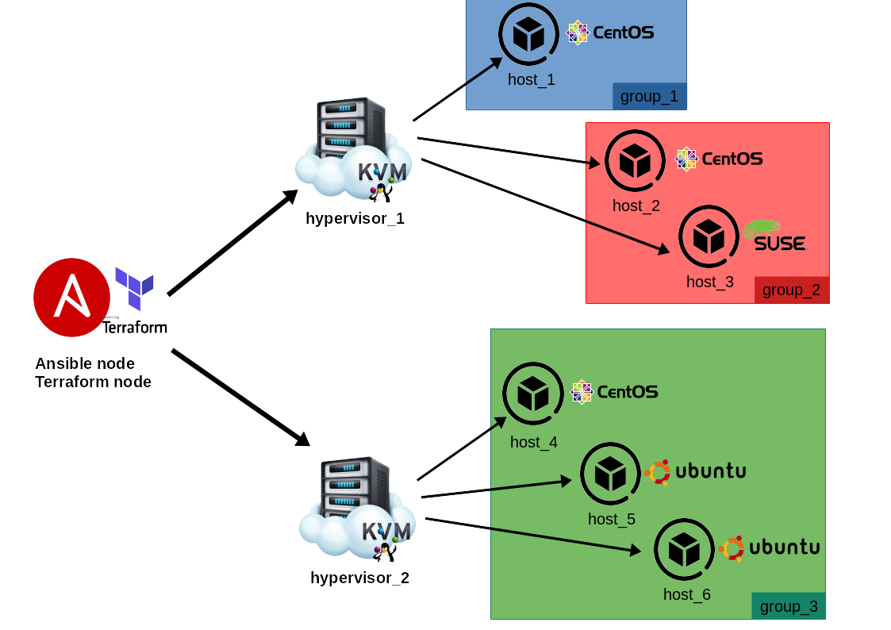
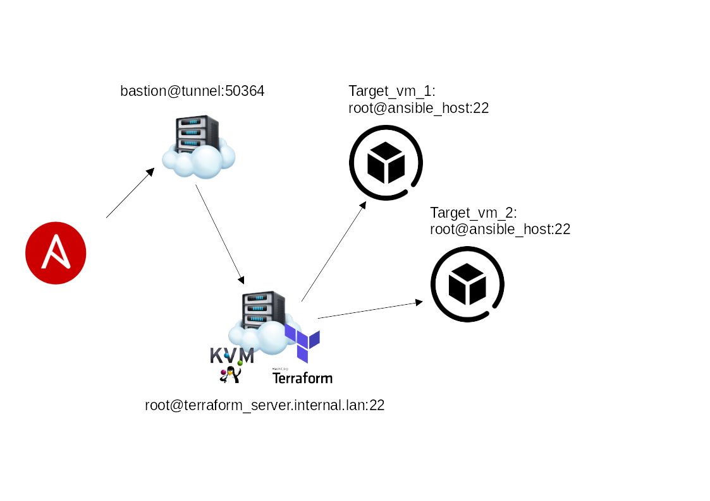

# kvm-deployment

[](https://www.gnu.org/licenses/gpl-3.0)  

This **Ansible** role allow you to initialize and then deploy virtual machines through **Terraform** on a **KVM** server.

## How It Works

The idea comes from the difficulty to automate the deployment of the VMs on a **KVM** environment.

For this reason we decided to automate as much as possible the process of the deployment, using **Ansible** and **Jinja2**.

First of all we provided a basic **HCL** file (templated with **Jinja2**) to describe a basic VM implementation. This is what is usually called IaC.

Then using **Terraform** and its amazing provider for **libvirt** (https://github.com/dmacvicar/terraform-provider-libvirt), we deploy the resultants **HCL** files generated by **Ansible**.

The figure below describe the process in an easy way.

](./pics/kvm-deployment.png)

As you can see, we start having the templated file (`terraform-vm.tf.j2`). 

When Ansible run, it generates *n* `.tf` files, depending on the VM specified into the inventory. This is the result of the **init** phase. Once finished this task, the files are completed and ready to be used by **Terraform**.

At this time, Ansible takes these files and use **Terraform** for each instance of them. Once finished this task, the VMs, previously described into the inventory, are correctly deployed into the **KVM** server(s).

## Configuration

First of all you have to compose the inventory file in a right way. This means you have to describe the VMs you want to deploy into the server. 

As you are going to check, there are some interesting variables you are allowed to use to properly describe your infrastructure. Some of them are `required` and some others are `optional`.

Below you can check the basic structure for the inventory.

```yaml
all:
    vars:
        ...
    children:
        hypervisor_1:
            vars:
                provider_uri: ...
                pool_name: ...
                ...
            hosts:
                terraform_node:
                    ansible_host: ...
            children:
                group_1:
                    hosts:
                        host_1:
                            ...
                    vars:
                        ...
                group_2:
                    hosts:
                        host_2:
                            ...
                        host_3:
                            ...
        hypervisor_2:
            vars:
                provider_uri: ...
                pool_name: ...
                ...
            hosts:
                terraform_node:
                    ansible_host: ...
            children:
                group_3:
                    hosts:
                        host_4:
                            ...
                    vars:
                        ...
                group_4:
                    hosts:
                        host_5:
                            ...
```

Under the 1st `vars` tag, you can specify the various hypervisors you want to use to distribute your infrastructure.

Here's a little example:

```yaml
all:
    vars:
        hypervisor_1:
            vars:
                provider_uri: "qemu:///system"
                pool_name: defaul
            hosts:
                terraform_node:
                    ansible_host: 127.0.0.1
                    ansible_connection: local
        ...
```

In this example we specified the *uri* of the KVM server (which is going to be common for all the VMs in this hypervisor group), 
the *storage pool* name of the KVM server and the *terraform node* address, which specify where Terraform is installed and where is going to be ran.

Now, for each VM we want to specify some property such as the number of the cpu(s), memory ram, mac_address, etc.

Here's a little example:

```yaml
        ...
        hypervisor_1:
            vars:
                provider_uri: "qemu:///system"
                pool_name: default
                disk_source: "~/VirtualMachines/centos8-terraform.qcow2"
            hosts:
                terraform_node:
                    ansible_host: 127.0.0.1
                    ansible_connection: local
            children:
                group_1:
                    hosts:
                        host_1:
                            os_family: RedHat
                            cpu: 4
                            memory: 8192
                            network_interfaces:
                                ...
                group_2:
                    hosts:
                        host_2:
                            os_family: RedHat
                            cpu: 2
                        host_3:
                            os_family: Suse
                            disk_source: "~/VirtualMachines/opensuse15.2-terraform.qcow2"
                            cpu: 4
                            memory: 4096
                            set_new_passowrd: password123
                            network_interfaces:
                                ...
```

In this example, we specified 2 main groups (`group_1`, `group_2`) inside the `hypervisor_1`.
These groups are composed overall by 3 machines (`host_1`, `host_2`, `host_3`). 
As you can see, not all the properties are specified for each machine. This is due to the default values of the variables provided by this role. 

Thanks to the variabe hierarchy in Ansible, you can configure variables:

- Hypervisor wise
- VM groups wise
- Single VM wise

This will make easier to manage large homogeneous clusters, still retaining the power of per-VM customization.



In the example above, we can see, for `hypervisor_1`, the default OS for VMs is **Centos**, but we specified for `host_3` to be an **OpenSuse** node. Similarly for the `hypervisor_2`, the default OS for VMs is **Ubuntu**, but we specified  for the `host_4` to be a **Centos** node.

This is valid for **any** variable in the playbook.

You can check the default values under `default/main.yml`.

### Variables

Once you understand how to fill the inventory file, you are ready to check all the available variables to generate your infrastructure.

These variables are **required**, they should be declared on per-hypervisor scope:

* **ansible_host:** `required`. Specify the ip address for the VM. If not specified, a random ip is assigned.
* **ansible_jump_hosts:** `required` if **terraform_bastion_enabled** is `True`. Specify one or more jumphost/bastions for the ansible provisioning part.
* **disk_source:** `required`. Specify the (local) path to the virtual disk you want to use to deploy the VMs.
* **data_disks:** `optional`. Specify additional disks to be added to the VM. Check disks section for internal required varibles: [HERE](#disk)
* **network_interfaces**: `required`. Specify VM's network interfaces, check network section for internal required variables: [HERE](#network)
* **os_family:** `required`. Specify the OS family for the installation. Possible values are: `RedHat`, `Debian`, `Suse`, `FreeBSD`.
* **pool_name:** `required`. Specify the *storage pool* name where you want to deploy the VMs on the KVM server.
* **provider_uri:** `required`. Specify the uri of the KVM server. You can use `qemu:///system` if the KVM server is you own computer, or `qemu+ssh://USER@IP:PORT/system` (or different) if your server is remote.
* **ssh_password:** `required`. Specify the password to access the deployed VMs.
* **ssh_port:** `required`. Specify the port to access the deployed VMs.
* **ssh_user:** `required`. Specify the user to access the deployed VMs.
* **terraform_node:** `required`. Specify the ip of the machine that performs the Terraform tasks. The default value of 127.0.0.1 indicates that the machine that perform Terraform tasks is the same that launches the Ansible playbook. In case the Terraform machine is not the local machine, put the ip/hostname of the Terraform node.
* **terraform_bastion_enabled:** `required`. Specify `True` or `False`. In case the **terraform_node** and KVM server differ, you should enable the bastion. This will enable the use of the KVM server as jumphost to enter th VMs via ssh.
* **terraform_bastion_host:** `required` if **terraform_bastion_enabled** is `True`. Specify the ip address of the bastion host.
* **terraform_bastion_password:** `required` if **terraform_bastion_enabled** is `True`. Specify the password of the bastion host.
* **terraform_bastion_port:** `required` if **terraform_bastion_enabled** is `True`. Specify the port (for the ssh connection) of the bastion host.
* **terraform_bastion_user:** `required` if **terraform_bastion_enabled** is `True`. Specify the user of the bastion host.

These variable are optional, there are sensible defaults set up, most of them can be declared from **hypervisor scope** to **vm-group scope** and **per-vm scope**:

* **change_passwd_command:** `optional`. Specify a different command to be used to change the password to the user. If not specified the default command is used. Default: `echo root:{{ set_new_password }} | chpasswd`. This variable become really useful when you are using a FreeBSD OS.
* **cpu:** `optional`. Specify the cpu number for the VM. If not specified, the default value is taken. Default: `1`
* **memory:** `optional`. Specify the memory ram for the VM. If not specified, the default value is taken. Default: `1024`
* **set_new_password:** `optional`. Specify a new password to access the Vm. If not specified, the default value (**ssh_password**) is taken.

#### Bastions, Jumphosts, Remote Nodes

As stated in the above list, it is possible to use a `terraform_bastion_enabled` variable also declaring:

* **terraform_bastion_host**
* **terraform_bastion_password**
* **terraform_bastion_port**
* **terraform_bastion_user**

to declare what jump host `terraform` will use to finish provisioning the machine when deploying.

If `terraform_bastion_enabled` is set to `True`, all the above variables are required, including `ansible_jump_hosts` list

**Ansible Jumphosts list**

Example:

```yaml
        ansible_jump_hosts:
          - {user: root, host: terraform_server.internal.lan, port: 22}
          - {user: bastion, host: tunnel, port: 22}
```

declaring one or multiple jump hosts, will generate automatically all the ssh arguments needed to perform
single/multiple hops for ansible.

Be aware that the order of declaration is from *farther to nearest* hops, so if you have something like:

- bastion_1
- bastion_2
- bastion_3

the order of the hops starting from the ansible executor will be:

- ansible executor
- bastion_3
- bastion_2
- bastion_1
- target_host

in the example above we have:



#### Network

Network declaration is **mandatory** and **per-vm**.

Declare each device you want to add inside the `network_interfaces` dictionary.

**Remember that** :

- **the order of declaration is important**
- the NAT device should **always be present** (unless you can control your DHCP leases
    for the external devices) and that should be **the FIRST device**.
    It is important because it's the way the role has to communicate
    with the VM **BEFORE** setting up all the userspace networks.

Supported interface types: 

* `nat`
* `macvtap`
* `bridge`

the default_route should be assigned to **ONE** interface to function properly.
If not set it's equal to False.

Structure:

```yaml
        hypervisor_1:
            vars:
                provider_uri: "qemu:///system"
                pool_name: default
                disk_source: "~/VirtualMachines/centos8-terraform.qcow2"
            hosts:
                terraform_node:
                    ansible_host: 127.0.0.1
                    ansible_connection: local
            children:
                group_1:
                    hosts:
                        host_1:
                            ansible_host: 172.16.0.155
                            os_family: RedHat
                            cpu: 4
                            memory: 8192
                            network_interfaces:
                                # Nat interface, it should always be the first one you declare.
                                # it does not necessary have to be your default_route or main ansible_host,
                                # but it's important to declare it so ansible has a way to communicate with
                                # the VM and setup all the remaining networks.
                                iface_1:
                                  name: nat             # mandatory
                                  type: nat             # mandatory
                                  ip: 192.168.122.47    # mandatory
                                  gw: 192.168.122.1     # mandatory
                                  dns:                  # mandatory
                                   - 1.1.1.1
                                   - 8.8.8.8
                                  mac_address: "AA:BB:CC:11:24:68"   # optional
                                  # default_route: False
                                iface_2:
                                  name: ens1p0      # mandatory 
                                  type: macvtap     # mandatory
                                  ip: 172.16.0.155  # mandatory
                                  gw: 172.16.0.1    # mandatory
                                  dns:              # optional
                                   - 1.1.1.1
                                   - 8.8.8.8
                                  default_route: True # at least one true mandatory, false is optional.
```

Variables explanation:

* **name:** `required` Specify the name for the connection, this is important for `bridge` and `macvtap` types as it will be the interface/bridge on the host on which they will be created.
* **type:** `required` Specify the type of the interface, supported types are **nat**, **macvtap**, **bridge**.
* **ip:** `required` Specify the IP to assign to this interface.
* **gw:** `required` Specify the Gateway of this interface.
* **default_route:** `at least one required` Specify if this interface is the default route or not. **At least one interface at True**.
* **dns:** `required` Specify the dns list for this interface, this is an array of IPs.
* **mac_address:** `optional` Specify the mac address for this interface.


The playbook will use the available IP returned from the `terraform apply` command to access the machines
and use the `os_family` way to setup the user-space part of the network:

- static IPs
- routes
- gateways
- DNS

After this, the playbook will set the `ansible_host` variable to its original value, and proceed with
the provisioning.

This is important because it will make `ansible_host` independent from the internal management interface
needed for this network bootstrap tasks, making it easily compatible with any type of role that you
want to perform after this.

#### Disk

This section explain how you can add some additional disk to the VMs.

Suppose you want to create a VM that needs a large amount of storage space, and a separated disk just to store the configurations. Doing this is quite simple.

The main variable you need is `data_disks`. The you have to specify the disks and the related properties for each of them.

If `data_disks` is mentioned in your inventory, the following variables are required:

* **size:** `required`. Specify the disk size expressed in GB. (es. `size: 1` means 1GB)
* **pool:** `required`. Specify the pool where you want to store the additional disks.
* **format:** `require`. Specify the filesystem format you want to apply to the disk. Supported formats are: `ext4`, `ext3`, `ext2`, `xfs` for Linux VMs and `freebsd-ufs` for FreeBSD VMs.
* **mount_point:** `required`. Specify the mount point of the disk.

Let's take a look at how the *inventory* file is going to be fill.

```yaml
        hypervisor_1:
            vars:
                provider_uri: "qemu:///system"
                pool_name: default
                disk_source: "~/VirtualMachines/centos8-terraform.qcow2"
            hosts:
                terraform_node:
                    ansible_host: 127.0.0.1
                    ansible_connection: local
            children:
                group_1:
                    hosts:
                        host_1:
                            ansible_host: 172.16.0.155
                            os_family: RedHat
                            cpu: 4
                            memory: 8192
                            # Here we start to declare 
                            # the additional disk.
                            data_disks:
                                # Here we declare the disk name
                            	disk-storage:
                            		size: 100                       # Disk size = 100 GB
                            		pool: default                   # Store the disk image into the pool = default.
                            		format: xfs                     # Disk Filesystem = xfs
                            		mount_point: /mnt/data_storage  # The path where the disk is mounted
                                # Here we declare the disk name
                            	disk-config:
                            		size: 1                         # Disk size = 1 GB
                            		pool: default                   # Store the disk image into the pool = default.
                            		format: ext4                    # Disk Filesystem = ext4
                            		mount_point: /mnt/data_config   # The path where the disk is mounted
```


## Support

Actually the role is supporting the most common 4 OS families for the Guests:

* RedHat (including Centos, Fedora and derivates)
* Debian (Including Ubuntu and derivates)
* Suse (Thumbleweed and Leap)
* FreeBSD

This means you are able to generate the infrastructure using the OS listed above.

Hypervisor OS is agnostic, as long as **libvirt** is installed.

## Usage

Once composed the inventory file, it's time to run your playbook.

To pull up infrastructure:
```bash
ansible-playbook -i inventory.yml -u root main.yml
```

To pull down infrastructure:
```bash
ansible-playbook -i inventory.yml -u root main.yml --tags destroy
```
